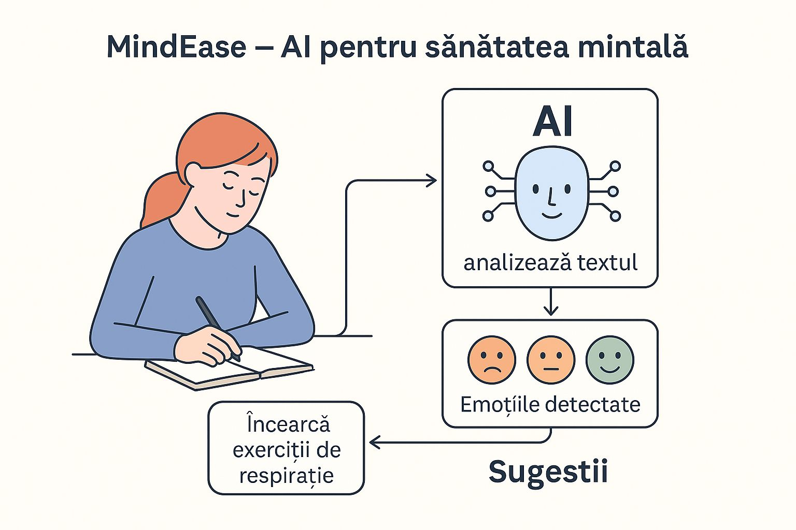

# Project Title

MindEase – AI pentru sănătatea mintală

## Summary

MindEase este o aplicație AI care analizează textele scrise de utilizatori pentru a detecta semne timpurii de stres, anxietate sau depresie și oferă sugestii personalizate pentru îmbunătățirea stării de bine.  

## Background

Mulți oameni trec prin perioade dificile fără să-și dea seama că au nevoie de ajutor. Din păcate, recunoașterea timpurie a problemelor mintale este rară, iar accesul la psihologi nu este întotdeauna posibil.

* Tulburările de sănătate mintală afectează peste 1 miliard de oameni la nivel global.
* Multe persoane nu cer ajutor de teamă, rușine sau lipsă de timp.
* Am observat în cercul meu apropiat cât de greu este pentru unii să vorbească despre ceea ce simt.

MindEase ajută la conștientizarea stării emoționale printr-o metodă discretă, personalizată și accesibilă.

## How is it used?

Utilizatorul introduce gânduri zilnic într-un jurnal digital sau răspunde la întrebări despre starea sa. Modelul AI analizează limbajul natural și identifică semnale subtile de stres, anxietate sau depresie. Pe baza analizei, aplicația oferă sugestii personalizate: exerciții de respirație, sugestii de activități, jurnal de recunoștință etc.

Este util în:
* contexte personale – pentru auto-monitorizare
* educație – pentru a susține elevii/studenții
* companii – pentru wellbeing-ul angajaților

## Data sources and AI methods

Datele provin de la utilizator (texte scrise), cu consimțământul acestora. Într-un demo, se pot folosi seturi de date open-source cu texte etichetate emoțional.

* [GoEmotions Dataset by Google](https://huggingface.co/datasets/go_emotions)
* [HuggingFace Transformers](https://huggingface.co/docs/transformers/index)

Metode AI:
* NLP – analiza de sentiment cu modele ca BERT, RoBERTa
* Clasificare multi-label a emoțiilor
* Detecția pattern-urilor negative recurente

Exemplu de cod:
from transformers import pipeline
classifier = pipeline(“text-classification”, model=“bhadresh-savani/distilbert-base-uncased-emotion”)
text = “I feel like nothing I do matters anymore.”
print(classifier(text))
 ## Challenges

* Nu poate înlocui un diagnostic clinic real.
* Posibile interpretări greșite în lipsa contextului complet.
* Confidențialitatea datelor este esențială – necesită criptare și protecție riguroasă.
* Diferențele culturale pot influența interpretarea emoțiilor din limbaj.

## What next?

Proiectul poate fi extins pentru a integra:
* analiză vocală și expresii faciale
* date biometrice de la smartwatch-uri (somn, puls)
* colaborări cu psihologi pentru validarea sugestiilor

Ar fi util sprijin în:
* dezvoltare mobilă (iOS/Android)
* validare științifică
* UI/UX design

## Acknowledgments

* Inspirație din aplicații ca [Woebot](https://woebothealth.com/) și [Wysa](https://www.wysa.io/)
* Date de antrenare: [GoEmotions by Google](https://github.com/google-research/google-research/tree/master/goemotions)
* Model NLP: [distilbert-base-uncased-emotion](https://huggingface.co/bhadresh-savani/distilbert-base-uncased-emotion)
* [Sad Girl by Unknown](https://commons.wikimedia.org/wiki/File:Sad_Girl.jpg) / [CC BY-SA 4.0](https://creativecommons.org/licenses/by-sa/4.0)
